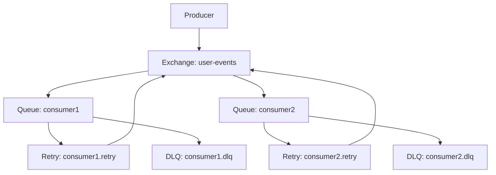
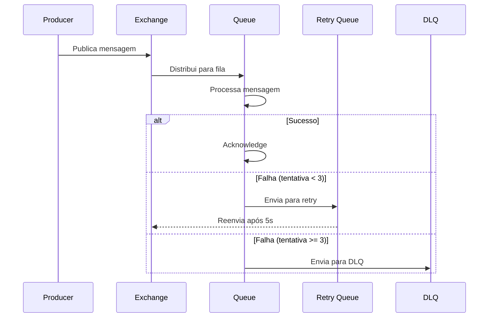

# Arquitetura do EventBusService

## Visão Geral
O EventBusService é uma implementação de message broker usando RabbitMQ com suporte a fanout exchange, dead letter queues (DLQ) e retry mechanism. A arquitetura permite que múltiplos consumidores recebam as mesmas mensagens de forma independente, cada um com sua própria fila de retry e DLQ.

## Componentes Principais

### Exchange Principal (Fanout)
- Distribui mensagens para todas as filas vinculadas
- Não utiliza routing keys
- Garante que todas as filas recebam cópias das mensagens

### Filas
Cada consumidor tem seu próprio conjunto de filas:
- Fila principal: Recebe mensagens do exchange fanout
- Fila de retry: Gerencia retentativas com delay
- Dead Letter Queue (DLQ): Armazena mensagens que falharam após todas as retentativas

## Diagramas

### Arquitetura de Exchanges e Filas



### Fluxo de Mensagens



## Implementação

### Criando um Producer

```typescript
const producer = new EventBusService(
    'amqp://localhost',
    'user-events',        // nome do exchange
    'not-needed',         // nome da fila (não usado no producer)
    'user-service',       // nome do serviço
    '1.0.0',             // versão
    3,                   // máximo de tentativas (opcional, padrão: 3)
    5000                 // delay entre tentativas em ms (opcional, padrão: 5000)
);

await producer.connect();

// Publicando mensagem
await producer.publish({
    type: 'user.created',
    data: Buffer.from(JSON.stringify({ id: '123' })),
    metadata: {
        contentType: 'application/json'
    }
});
```

### Criando um Consumer

```typescript
const consumer = new EventBusService(
    'amqp://localhost',
    'user-events',        // mesmo exchange do producer
    'email-service',      // nome único da fila
    'email-service',
    '1.0.0'
);

await consumer.connect();

// Registrando handler
consumer.subscribe('email-handler', async (data, properties) => {
    const userData = JSON.parse(data.toString());
    await sendEmail(userData);
});

// Iniciando consumo
await consumer.consume();
```

## Características Importantes

### Retry Mechanism
- Máximo de tentativas configurável (padrão: 3 tentativas por mensagem)
- Delay configurável entre tentativas (padrão: 5 segundos)
- Contagem de tentativas mantida no header 'x-retry-count'

### Dead Letter Queue
- Mensagens vão para DLQ após exceder tentativas
- Cada consumidor tem sua própria DLQ
- Permite análise posterior de falhas

### Independência de Consumidores
- Falha em um consumidor não afeta outros
- Cada consumidor gerencia suas próprias retentativas
- DLQs separadas permitem tratamento específico por consumidor

## Boas Práticas

1. **Nomeação**
   - Use nomes descritivos para exchanges e filas
   - Inclua ambiente em nomes de filas (ex: email-service.prod)

2. **Monitoramento**
   - Monitore tamanho das filas
   - Acompanhe taxa de mensagens na DLQ
   - Configure alertas para falhas de conexão

3. **Tratamento de Erros**
   - Implemente logging adequado
   - Considere circuit breakers para dependências externas
   - Planeje estratégia de retry apropriada para cada caso
